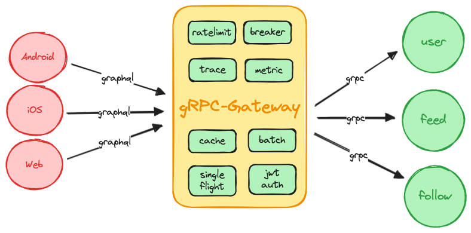
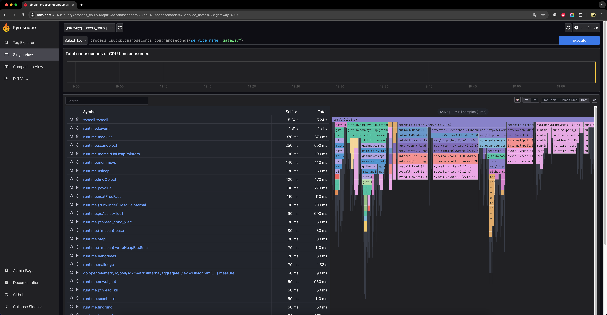

# GraphQL gRPC gateway

[](https://github.com/sysulq/graphql-grpc-gateway/actions/workflows/go.yml)
[](https://codecov.io/gh/sysulq/graphql-grpc-gateway)

This is a simple gateway that can be used to expose multiple gRPC services as a GraphQL server.



## Pre-requisites

- [Task](https://taskfile.dev/#/installation)
- [Docker](https://docs.docker.com/get-docker/)
- [Docker Compose](https://docs.docker.com/compose/install/)
- [Go](https://golang.org/doc/install)

## Installation

To install the dependencies, run the following command:

```bash
docker-compose -f "deployment/docker-compose.yml" up -d
```

## Getting started

To start the gateway, run the following command:

```bash
task run
```

```text
task: [optionsserver] go run ./example/gateway/optionsserver
task: [gateway] KOD_CONFIG=./example/gateway/config.yaml go run ./cmd/gateway
task: [constructsserver] go run ./example/gateway/constructsserver
2024/07/18 19:53:26 INFO grpc server started on: [::]:8082
2024/07/18 19:53:26 INFO grpc server started on: [::]:8081
2024/07/18 19:53:26 [INFO] Gateway listening on address: [::]:8080
2024/07/18 19:53:27 INFO Register service key=local/optionsserver/grpc/172.19.43.45:8082
2024/07/18 19:53:27 INFO Register service key=local/constructsserver/grpc/172.19.43.45:8081
```

## Test the gateway

```bash
task curl
```

```text
task: [curl] curl 'http://localhost:8080/playground' -H 'Content-Type: application/json' --data-binary @test/post2.json -v
*   Trying 127.0.0.1:8080...
* Connected to localhost (127.0.0.1) port 8080 (#0)
> POST /playground HTTP/1.1
> Host: localhost:8080
> User-Agent: curl/8.1.2
> Accept: */*
> Content-Type: application/json
> Content-Length: 423
> 
< HTTP/1.1 200 OK
< Content-Type: application/json
< Date: Thu, 18 Jul 2024 11:55:21 GMT
< Content-Length: 320
< 
* Connection #0 to host localhost left intact
{"data":{"serviceQuery1":{"float":[111],"foo":{"param1":"para"},"string":"sdfs","string2":"ssdfsd"},"serviceQuery2":{"float":[111],"foo":{"param1":"para"},"string":"sdfs","string2":"ssdfsd"}},"extensions":{"persistedQuery":{"sha265Hash":"5c898c064b9290d7b66dce6267db15478f8cd52e19498cde4b040f0e456e371d","version":"1"}}}
```

## Benchmark

To run the benchmark, run the following command:

```bash
task bench
```

```text
task: [bench] ab -n 50000 -kc 500 -T 'application/json' -H 'Accept-Encoding: gzip, deflate, br' -p test/post1.json http://localhost:8080/query
This is ApacheBench, Version 2.3 <$Revision: 1903618 $>
Copyright 1996 Adam Twiss, Zeus Technology Ltd, http://www.zeustech.net/
Licensed to The Apache Software Foundation, http://www.apache.org/

Benchmarking localhost (be patient)
Completed 5000 requests
Completed 10000 requests
Completed 15000 requests
Completed 20000 requests
Completed 25000 requests
Completed 30000 requests
Completed 35000 requests
Completed 40000 requests
Completed 45000 requests
Completed 50000 requests
Finished 50000 requests


Server Software:        
Server Hostname:        localhost
Server Port:            8080

Document Path:          /query
Document Length:        229 bytes

Concurrency Level:      500
Time taken for tests:   1.278 seconds
Complete requests:      50000
Failed requests:        0
Keep-Alive requests:    50000
Total transferred:      18100000 bytes
Total body sent:        21100000
HTML transferred:       11450000 bytes
Requests per second:    39131.19 [#/sec] (mean)
Time per request:       12.778 [ms] (mean)
Time per request:       0.026 [ms] (mean, across all concurrent requests)
Transfer rate:          13833.49 [Kbytes/sec] received
                        16126.33 kb/s sent
                        29959.82 kb/s total

Connection Times (ms)
              min  mean[+/-sd] median   max
Connect:        0    0   1.6      0      23
Processing:     0   12  11.0      9     102
Waiting:        0   12  11.0      9     102
Total:          0   13  11.2      9     102

Percentage of the requests served within a certain time (ms)
  50%      9
  66%     13
  75%     16
  80%     18
  90%     28
  95%     37
  98%     48
  99%     53
 100%    102 (longest request)
```

## Pyroscope

Visiting [http://localhost:4040](http://localhost:4040) will show the Pyroscope dashboard.



## Uptrace

Visiting [http://localhost:14318/](http://localhost:14318/) will show the Uptrace dashboard.


